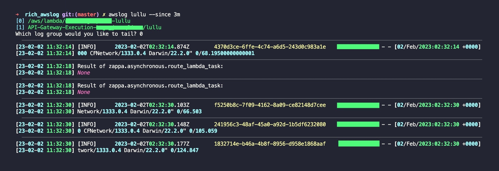
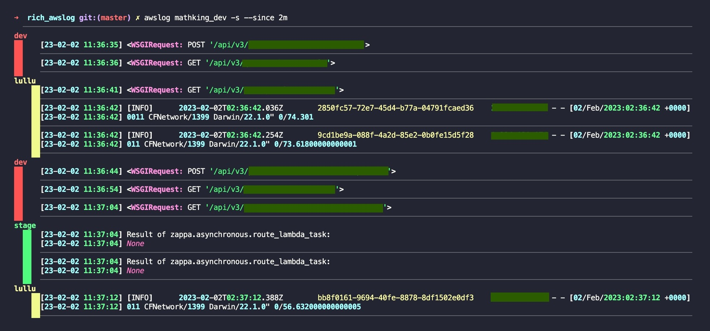

# rich_awslog

-   Tailing AWS CloudWatch Logs, using Zappa tail and rich print.

### Install

```bash
git clone https://github.com/esc5221/rich_awslog
cd rich_awslog
pip install -r requirements.txt
```

### Setup

-   run `python3 awslog.py` and set alias to shell profile

    ```bash
    $ cd rich_awslog
    $ python3 awslog.py
    ___________________________________________________________
    add below alias to ~/.zshrc or ~/.bashrc

    alias awslog='python3 /Users/esc5221/rich_awslog/awslog.py'
    ```

-   define log_set in `.awslog_config.json`
    -   example
        ```json
        {
            "log_set_1": {
                "log_groups": [
                    {
                        "alias": "dev",
                        "name": "/aws/lambda/dev_lambda_function"
                    },
                    {
                        "alias": "prod",
                        "name": "/aws/lambda/prod_lambda_function"
                    }
                ]
            }
        }
        ```

### Usage

```
usage: awslog.py [-h] [--since SINCE] [--filter FILTER] [--disable-keep-open] [-e] [-s] identifier

Tailing AWS CloudWatch Logs

positional arguments:
  identifier           The identifier of the cloudwatch log group.

options:
  -h, --help           show this help message and exit
  --since SINCE        Only show lines since a certain timeframe.
  --to TO              Only show lines before a certain timeframe.
  --filter FILTER      Apply a filter pattern to the logs.
  --disable-keep-open  Exit after printing the last available log, rather than keeping the log open.
  -e, --exact          Use identifier as an exact match.
  -s, --set            Use identifier as log set name.
```

1. Tailing single log
    - searching log group name and select (in case you don't know the exact name)
        ```bash
        $ awslog lambda --since 1h
        [0] /aws/lambda/dev_lambda_function
        [1] /aws/lambda/prod_lambda_function
        Which log group would you like to tail?
        ```
        - if there is only one log group, it will be selected automatically
    - provide exact log group name
        ```bash
        $ awslog /aws/lambda/dev_lambda_function -e --since 1h
        ```
        - `-e` option is for exact match
2. Tailing log_set logs (multiple log groups merged)
    ```bash
    $ awslog log_set_1 -s --since 1h
    ```
    - `-s` option is for using log set

### Screenshot

-   single log group tailing
    

-   log_set tailing
    
